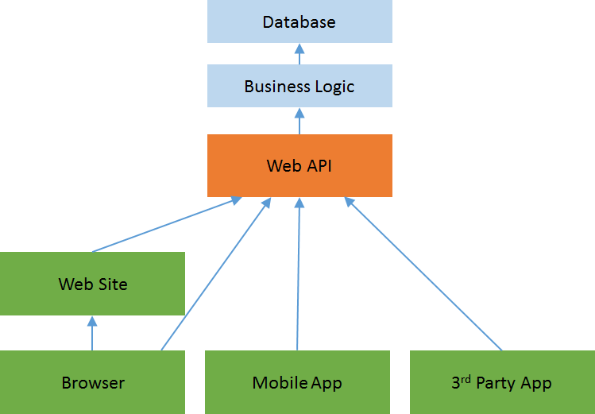
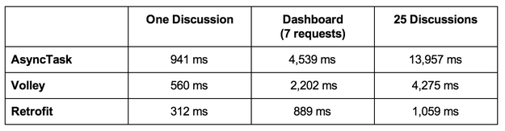

# Third-Party Libraries
### Matt Grasser
#### 15 Aug 2015 | Lesson 22 | C4Q AccessCode 2.1

---

## Before we get started...

A quick public service announcement...


---

## Congratulations!

You've made it a ton of the way through the C4Q AccessCode 2.1 curriculum. You're now well on your way to becoming an Android professional.

---

## Want to take it to the next level?!

Third-Party Libraries Can Help You Do It...Efficiently!

---

## Today's Main Contenders

* [Picasso](https://square.github.io/picasso/)
* [Butter Knife](https://jakewharton.github.io/butterknife/)
* [Retrofit](https://square.github.io/retrofit/)
* [Parceler](http://parceler.org/)
* [Dagger](https://square.github.io/dagger/)
* [...and more!](https://github.com/codepath/android_guides/wiki/Must-Have-Libraries)

---

## But Why?!

To quote [codepath](https://github.com/codepath) on github:

```
There are many third-party libraries for Android but several of them are 
"must have" libraries that are extremely popular and are often used in 
almost any Android project. Each has different purposes but all of them 
make life as a developer much more pleasant. 
```

---

## Ok, I see why. But how?!

Let's get to some examples...

---

## Example #1: Peter Griffin App

* **Goals**:
  * Download an image of Peter Griffin
  * Display it on the screen

---

## Peter Griffin on Picasso

We can do it better! Let's take a look at [Picasso](https://square.github.io/picasso/) for a moment.

---

## Benefits of Picasso

* Avoiding Common Pitfalls AUTOMATICALLY!
  * Handling ImageView recycling and download cancelation in an adapter.
  * Complex image transformations with minimal memory use.
  * Automatic memory and disk caching.
* Image handling can often be accomplished in a single line
  * Adapter Downloads (from web)
  * Image Transformations (change your image in preset and custom manners)
  * Local Resource Loading (drawables, local file location, File object)

---

## Example #2: Peter Griffin Super App!

* **Goals**:
  * Download an image of Peter Griffin
  * Display it on the screen
  * Display a button on the screen
  * When the button is clicked, play an mp3 sound

---

## Peter Griffin on Picasso with Butter Knife!

Once again, we can do it better...let's look at [what people are saying](http://www.thekeyconsultant.com/2013/09/5-reasons-you-should-use-butterknife.html) about a tool called [Butter Knife](https://jakewharton.github.io/butterknife/)

---

## Benefits of Butter Knife

* No more findViewById casting!
* Bind Listeners
  * No more funky `view.setOnClickListener(new OnClickListener() { ...` stuff!
  * No more funky `Activity implements OnClickListener` with `switch` statement!
* Bind target objects to View in addition to Activity objects
* Bind to View Lists and act on all objects at once!
* Automatic casting, even when you can't bind!

---

## Pretty cool! What other tools are out there?

Well, as a person who has spent a lot of time working with web APIs, my personal favorite in terms of simplifying code is Retrofit: "A type-safe REST client for Android and Java."

Before we dive in though let's do a quick review of REST APIs, as it's been a little while since it was covered [in a previous lesson](https://github.com/accesscode-2-1/unit-2/blob/master/lessons/08_Async-REST.md).

---

## Quick Review: What is a Web API?



---

## Quick Review: What is a Web API?

The main purpose of an API is to do some processing or storage away from the device itself.

---

## ReSTful APIs

* Verbs = HTTP Methods
  * Most common: POST, GET, PUT, DELETE
  * Translates to CRUD: Create, Read, Update, Delete
  * Less common: HEAD, PATCH, etc
* Nouns = Resources
* Query Params = Adjectives
  * URL Parameters
  * Request Body
  * Headers
* HTTP Response codes: 2xx, 4xx, 5xx
* Response bodies: JSON, XML, etc (we'll focus on the first)

---

## Examples of ReSTful APIs

* [Github](https://developer.github.com/v3/repos/)
* [Soundcloud](https://developers.soundcloud.com/docs/api/reference)
* [Stripe Payments](https://stripe.com/docs/api)
* [Facebook API (yes, the graph is still ReSTful)](https://developers.facebook.com/docs/graph-api/overview/)

---

## Java Methods for Communicating with External APIs

* HTTPRequest (inherited by HttpPost, HttpGet, etc)
* HTTPReponse (needs to be parsed manually or using a 3rd party lib)

---

## Classic Android Way

* Permissions in manifest!
* AsyncTask (keep off the main thread!)
* Use the associated Java HTTPRequest method
* Parse the text of the HTTPResponse into a JSONObject
* Parse the JSONObject into a native Java Object

---

## Example #3: Github App!

* **Goals**:
  * Make a request to retrieve a [list of repositories](https://developer.github.com/v3/repos/#list-user-repositories) for a given github user
  * Convert those repos into Java objects
  * Display in a list view

---

## Github App + GSON + Retrofit

Let's take a look at how we can strip this down even further! (A nice breakdown from start to finish for a general API can be found [here](https://guides.codepath.com/android/Consuming-APIs-with-Retrofit))

---

## Benefits of Retrofit + GSON

* Many many many fewer lines of code to make the actual request
* Intelligent parsing of responses into native Objects
* Speed!



---

## We have the data, now what?

[Parceler](http://parceler.org/) is an awesome tool for passing objects between views in an efficient manner.

---

## Dependency Injection

The value of Dependency Injection (DI) is explained quite well in [this video](https://www.youtube.com/watch?v=IKD2-MAkXyQ). Tools that incorporate the principles of DI in an elegant manner include:

* Butterknife for DI in views (why not RoboGuice? compile-time vs runtime reflection)
* Dagger for Dependency Injection (DI) of any Java Class
* Android Annotations for DI of any Java Class

At this stage, I'll leave it as an exercise to familiarize yourself with these tools. Great discussion of the merits of Dagger vs. other DI libs can be found [here](https://stackoverflow.com/questions/24351817/dagger-and-butter-knife-vs-android-annotations).

---

## The Sky's the Limit!

There is so much more available in the ecosystem. Although Square's Jake Wharton tends to dominate the industry's conversation with his amazing open source tools, there are many more from all over the place.

---

## Miscellaneous Libs

For instance, for visual scanning there's [ZXing](https://github.com/zxing/zxing), a barcode scanner, and [Card.io](https://github.com/card-io/card.io-Android-SDK), a visual credit card number/expiration/name reader.

For debugging there's [Hugo](https://github.com/JakeWharton/hugo) for outputting messages and timing for annotated methods, and [leakcanary](https://github.com/square/leakcanary) for reporting memory leaks.

---

## The Sky's the Limit!

A great aggregated collection of a wide variety of libraries can be found [here](https://github.com/codepath/android_guides/wiki/Must-Have-Libraries).

---

## Have Fun With It!

Cheers.
